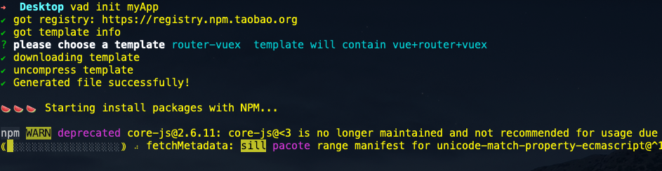
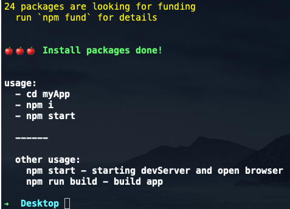
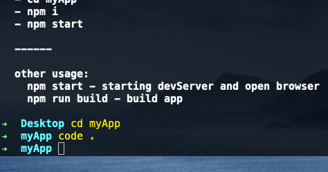

# @fow/vad-cli

vad-cli 是一个功能分发的容器, 能够帮助你快速搭建 vad 项目脚手架, 维护 vad 项目的生命周期. 比如开启开发服务器, 打包项目等等...


## 安装
全局安装 `@fow/vad-cli`, 可以得到一个 `vad` 命令.

```bash
# 全局安装 vad-cli
$ npm i -g @fow/vad-cli
```

## 使用

### 创建一个新项目

```bash
# 创建一个项目

$ vad init myApp

```

`init` 代表要生成一个新项目, `myApp` 就是项目的名字, 也是新创建的文件夹的名字. 

输入命令后, 会提示选择一个要初始化的项目脚手架, 不同的选择, 项目结构或者生成的文件会有不同.

比如选择了 `router-vuex` , 就代表这, 这个项目除了会使用 vue, 还会用到 `vue-router` 和 `vuex`.


比如选择了: router-vuex, 就会进入初始化和安装项目依赖包的流程, 等待结束即可:




根据提示, 我们进入 `myApp` 查看一下里面的文件:




可以看到, 项目中已经有了一些目录和文件, 依赖包已经安装好到 `node_modules` .

从 `package.json` 中可以看到 `cli` 已经预先帮我们填写了一些可以运行的 `npm scripts`. 内容可能根据 `@fow/vad-cli` 或 `@fow/vad-cli` 版本的不同而不同.


更多关于 项目结构的信息, 请查看 <a href="#/start/getting-started" target="_blank">@fow/vad</a> 文档.

### 运行开发服务器或打包项目

```bash
# 运行开发服务器
$ vad dev
# 或 
$ npm start 


# 打包项目
$ vad build
# 或
$ npm run build
```